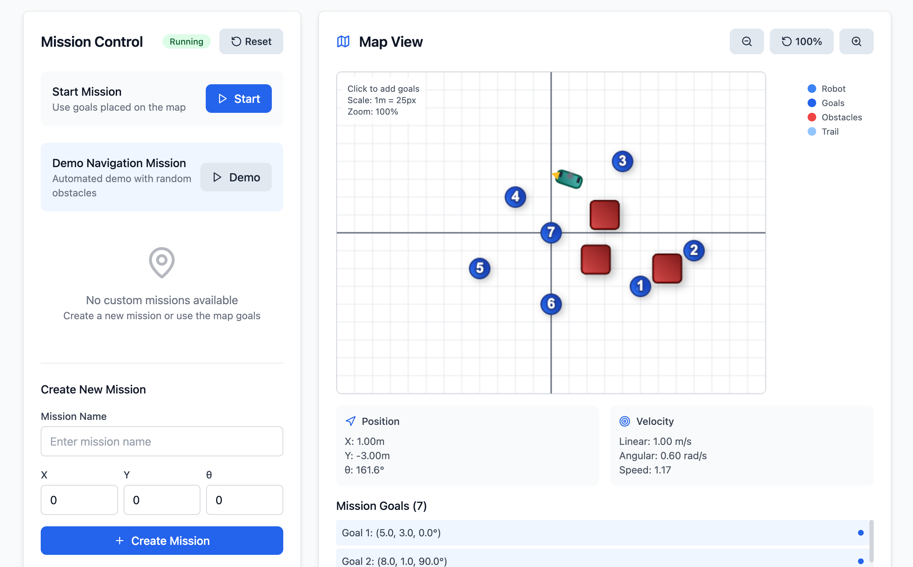
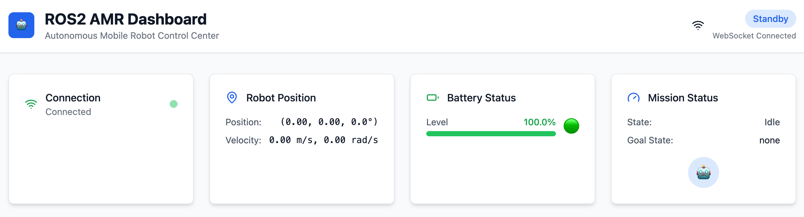
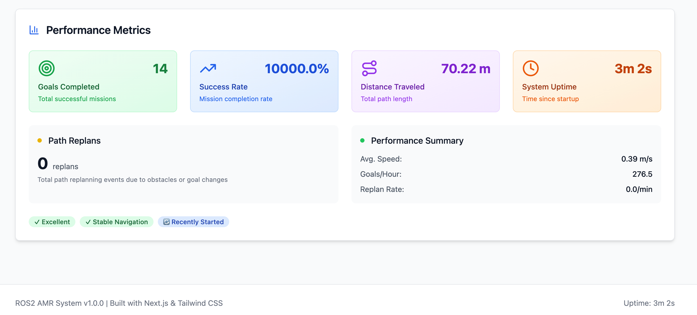

# ROS2 AMR - Autonomous Mobile Robot System

> **autonomous robot that navigates obstacles, executes missions, and delivers real-time insights through a stunning web dashboard.**

## 🖼️ System Overview

### Complete Dashboard Interface

*Full ROS2 AMR dashboard showing real-time robot status, mission control, map view, and performance metrics*

### Mission Control Panel

*Intuitive mission management with demo navigation, custom goal creation, and real-time execution controls*

### Robot Navigation & Map View

*Live map visualization with robot position, navigation trail, obstacles, and goal markers*

---

A comprehensive, demo-ready ROS2 Autonomous Mobile Robot (AMR) system featuring Nav2 navigation, real-time web dashboard, mission management, and automated data logging. Built for M3 Mac compatibility with Webots simulation and Docker-based ROS2 Humble deployment.

## 🚀 Features

- **🤖 Autonomous Navigation**: Nav2 stack with SLAM, path planning, and obstacle avoidance
- **🎯 Mission Management**: Queue-based goal execution with real-time status tracking
- **📊 Live Dashboard**: Next.js web interface with real-time telemetry and control
- **📈 Performance Metrics**: Prometheus-compatible metrics collection and visualization
- **📹 Automatic Recording**: Rosbag2 integration with mission-based start/stop
- **🔍 Fiducial Detection**: OpenCV-based ArUco marker recognition
- **🌐 WebSocket Bridge**: Real-time communication between ROS2 and dashboard
- **📱 Responsive UI**: Modern, mobile-friendly dashboard design

## 🏗️ Architecture

```
┌─────────────────┐    ┌─────────────────┐    ┌─────────────────┐
│   Webots Sim    │    │   ROS2 Stack    │    │   Dashboard     │
│                 │    │                 │    │                 │
│ • Diffbot Robot │◄──►│ • Nav2 Navigation│◄──►│ • Next.js UI    │
│ • Showfloor Map │    │ • Mission Mgmt  │    │ • Real-time     │
│ • Sensors       │    │ • Perception    │    │ • Control Panel │
│ • Physics       │    │ • Metrics       │    │ • Map View      │
└─────────────────┘    └─────────────────┘    └─────────────────┘
         │                       │                       │
         └───────────────────────┼───────────────────────┘
                                 │
                    ┌─────────────────┐
                    │  FastAPI Server │
                    │                 │
                    │ • REST API      │
                    │ • WebSocket     │
                    │ • Mission CRUD  │
                    └─────────────────┘
```

## 📁 Project Structure

```
ros2-amr/
├─ sim/                              # Webots simulation assets
│  ├─ worlds/showfloor.wbt           # Showroom environment
│  └─ robots/diffbot.wbo             # Differential drive robot
│
├─ ros2/                             # ROS2 packages (Docker)
│  ├─ packages/                      # ROS2 workspace packages
│  │  ├─ amr_bringup/                # System launch & configuration
│  │  ├─ amr_nav/                    # Nav2 configuration
│  │  ├─ amr_perception/             # Fiducial detection
│  │  ├─ amr_mission/                # Mission queue management
│  │  ├─ amr_bridge/                 # WebSocket/REST bridge
│  │  ├─ amr_metrics/                # Prometheus metrics
│  │  └─ amr_logger/                 # Rosbag2 recorder
│  ├─ overlays/                      # Maps and parameters
│  └─ docker/                        # Container configuration
│
├─ server/                           # FastAPI backend
│  ├─ app.py                         # Main API server
│  └─ requirements.txt               # Python dependencies
│
├─ dashboard/                        # Next.js frontend
│  ├─ components/                    # React components
│  ├─ pages/                         # Next.js pages
│  └─ styles/                        # Tailwind CSS
│
├─ ops/                              # Orchestration
│  ├─ compose.yml                    # Docker Compose
│  ├─ net.env                        # Network configuration
│  └─ Makefile                       # Operation commands
│
├─ scripts/                          # Utility scripts
│  ├─ record_demo.sh                 # Demo recording
│  └─ verify_topics.sh               # System verification
│
└─ media/                            # Documentation assets
    ├─ screenshots/                  # UI screenshots
    └─ README.md                     # Media documentation
```

## 🛠️ Quick Start

### Prerequisites

- **macOS** (tested on M3 Mac)
- **Docker Desktop** with 8GB+ RAM allocation
- **Node.js 20+** (for local dashboard development)
- **Webots 2023b** (optional, for simulation)

### Installation

1. **Clone and setup**:
   ```bash
   git clone <repository-url>
   cd ros2-amr
   ```

2. **Install dependencies**:
   ```bash
   # Install system requirements
   brew install docker docker-compose node
   
   # Install Webots (optional)
   brew install --cask webots
   ```

3. **Start the system**:
   ```bash
   cd ops
   make up
   ```

4. **Access the dashboard**:
   - **Dashboard**: http://localhost:3002
   - **API Server**: http://localhost:8002
   - **Metrics**: http://localhost:8080/metrics

### First Mission

1. Open http://localhost:3002 in your browser
2. Click "Start Demo Mission" in the Mission Panel
3. Watch the robot navigate in the Map View
4. Monitor real-time metrics in the Performance Panel

## 🎮 Usage Guide

### Dashboard Interface

#### Mission Panel
- **Create Missions**: Add custom goal points by clicking on the map
- **Start/Stop**: Control mission execution
- **Queue Management**: View and manage mission queue

#### Map View
- **Real-time Tracking**: See robot position and trail
- **Goal Setting**: Click anywhere to add navigation goals
- **Obstacle Visualization**: View detected obstacles and landmarks

#### Robot Status
- **Live Telemetry**: Position, velocity, battery level
- **Mission State**: Current status and progress
- **Connection Status**: WebSocket connectivity indicator

#### Metrics Panel
- **Performance Data**: Goals completed, success rate, distance traveled
- **System Health**: Uptime, replan count, navigation stability
- **Visual Indicators**: Status badges and trend analysis

### Command Line Operations

```bash
# System management
make up              # Start all services
make down            # Stop all services
make logs            # View all logs
make status          # Check service status

# ROS2 operations
make ros2-topics     # List ROS2 topics
make ros2-nodes      # List active nodes
make ros2-info       # System information

# Data management
make bag             # Start rosbag recording
make bag-list        # List available bags
make clean-bags      # Clean up recordings

# Development
make dev             # Start development environment
make test            # Run system tests
make shell           # Open ROS2 shell
```

### API Usage

#### REST Endpoints

```bash
# Get system status
curl http://localhost:8002/api/status

# Create a mission
curl -X POST http://localhost:8002/api/mission \
  -H "Content-Type: application/json" \
  -d '{
    "name": "Custom Mission",
    "goals": [
      {"x": 2.0, "y": 2.0, "theta": 0.0},
      {"x": -1.0, "y": 1.0, "theta": 1.57}
    ]
  }'

# Start mission
curl -X POST http://localhost:8002/api/mission/{mission_id}/start

# Stop mission
curl -X POST http://localhost:8002/api/mission/stop
```

#### WebSocket Events

```javascript
const ws = new WebSocket('ws://localhost:8002/ws');

ws.onmessage = (event) => {
  const data = JSON.parse(event.data);
  
  switch(data.type) {
    case 'status_update':
      // Robot status update
      break;
    case 'mission_started':
      // Mission started
      break;
    case 'mission_stopped':
      // Mission stopped
      break;
  }
};
```

## 📊 Performance Metrics

The system tracks comprehensive metrics:

| Metric | Description | Type |
|--------|-------------|------|
| `robot_pose_x/y/theta` | Current robot position | Gauge |
| `robot_velocity_linear/angular` | Current velocities | Gauge |
| `mission_goals_completed` | Total completed goals | Counter |
| `mission_total_replans` | Path replanning events | Counter |
| `mission_distance_traveled` | Total distance | Counter |
| `mission_success_rate` | Completion rate | Gauge |
| `battery_level` | Robot battery percentage | Gauge |
| `system_uptime` | System runtime | Counter |

### Prometheus Integration

Access metrics at http://localhost:8080/metrics for Prometheus scraping.

## 🔧 Configuration

### ROS2 Parameters

Key configuration files:
- `ros2/packages/amr_bringup/params/nav2_params.yaml` - Navigation parameters
- `ros2/packages/amr_bringup/params/robot_params.yaml` - Robot configuration
- `ros2/overlays/maps/showfloor.yaml` - Map configuration

### Environment Variables

```bash
# Network configuration
API_URL=http://localhost:8002
WS_URL=ws://localhost:8002/ws
PORT_DASHBOARD=3002
PORT_SERVER=8002

# ROS2 configuration
RMW_IMPLEMENTATION=rmw_fastrtps_cpp
ROS_DOMAIN_ID=0

# Development settings
DEBUG=false
NODE_ENV=development
```

## 🐛 Troubleshooting

### Common Issues

#### Services Won't Start
```bash
# Check Docker resources
docker system df
docker system prune -f

# Restart Docker Desktop
# Increase memory allocation to 8GB+
```

#### WebSocket Connection Failed
```bash
# Check if API server is running
curl http://localhost:8002/health

# Check logs
make logs-server
```

#### ROS2 Topics Missing
```bash
# Verify system health
./scripts/verify_topics.sh

# Check ROS2 logs
make logs-ros2

# Restart system
make down && make up
```

#### Webots Simulation Issues
```bash
# Check Webots logs
make logs-webots

# Restart Webots container
make webots-restart

# Verify display settings
echo $DISPLAY
```

### System Requirements

- **CPU**: 4+ cores recommended
- **RAM**: 8GB minimum, 16GB recommended
- **Storage**: 10GB free space
- **Network**: Local network access for WebSocket

## 📈 Performance Optimization

### Docker Resource Allocation
```bash
# Docker Desktop settings
CPU: 4+ cores
Memory: 8GB+
Swap: 2GB+
```

### ROS2 Performance Tuning
- Adjust `controller_frequency` in nav2_params.yaml
- Optimize costmap resolution and update rates
- Tune DWB controller parameters for your robot

### Dashboard Performance
- Enable browser hardware acceleration
- Use Chrome/Edge for best WebSocket performance
- Monitor memory usage in browser dev tools

## 🤝 Contributing

1. Fork the repository
2. Create a feature branch: `git checkout -b feature-name`
3. Make changes and test thoroughly
4. Submit a pull request with detailed description

### Development Setup

```bash
# Development environment
make dev

# Run tests
make test

# Code formatting
npm run lint
```

## 📄 License

This project is licensed under the Apache-2.0 License - see the LICENSE file for details.

## 🙏 Acknowledgments

- **ROS2 Community** for the excellent navigation stack
- **Webots** for the realistic simulation environment
- **Nav2 Team** for the comprehensive navigation framework
- **OpenCV** for computer vision capabilities
- **Next.js** and **Tailwind CSS** for the modern dashboard

## 📞 Support

- **Issues**: GitHub Issues for bug reports
- **Discussions**: GitHub Discussions for questions
- **Documentation**: This README and inline code comments

---

**Built with ❤️ for the ROS2 community**

*Perfect for demonstrations, educational purposes, and as a foundation for real-world AMR applications.*

